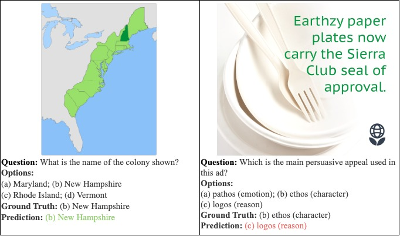

# Project for CS886 Foundation Models

We conducted an extensive ablation study on InstructBLIP, fine-tuning various components with LoRA while freezing the remainder. Our findings reveal that fine-tuning the LLM component yields superior results compared to fine-tuning the Q-Former component for multimodal reasoning tasks, particularly those formulated as multiple-choice questions. Furthermore, even fine-tuning with a rank as low as one or two proves adequate to achieve competitive performance compared to fully fine-tuned InstructBLIP models utilizing larger backbones. With FlanT5XL backbone, this approach resulted in achieving the highest fine-tuning accuracy of 75.3 on the IconQA dataset and 87.3 on the ScienceQA dataset, competitive to the full fine-tuning accuracy of a FlanT5XXL InstructBLIP model on ScienceQA (90.7).

Our project report can be found [here](./MLLM%20Fine-tuning.pdf).